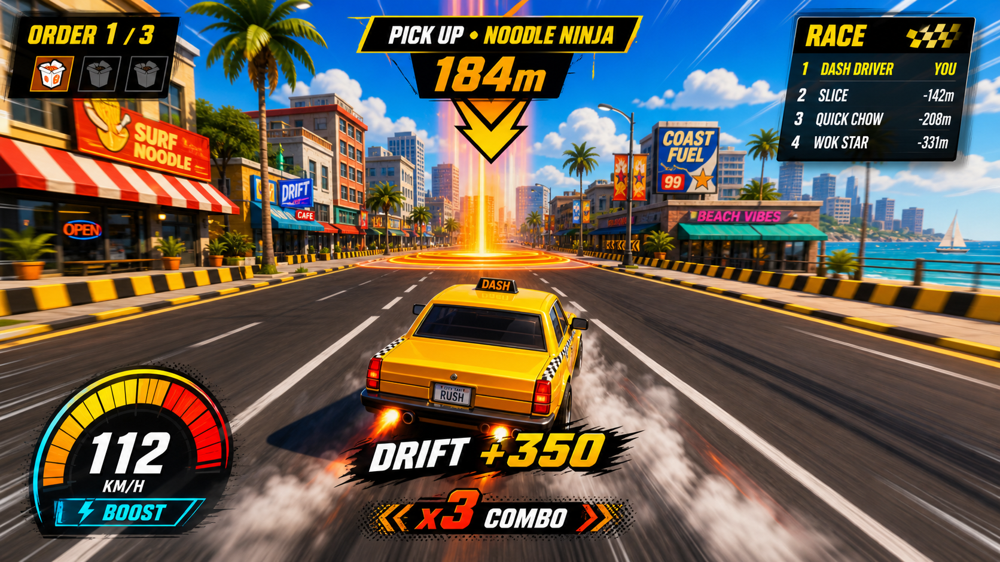

# Delivery Dash

Delivery Dash is a multiplayer 3D arcade racing game where drivers tear through a procedural city to pick up food, reach customers, and finish three deliveries before everyone else.



## Features

- Same-origin multiplayer over Cloudflare Durable Object WebSockets
- Procedural 12×12 city with downtown, midtown, and outskirt districts, shared by client and server
- Two stacked elevated expressways with approach ramps, on-ramps, guardrail gaps, and underpasses
- Jump ramps, boost strips, air time, and vertical car physics with roof and deck landings
- Moving traffic, kerb parking, signals, and street furniture on every block
- Server-authoritative pickup, drop-off, and race progression
- Arcade driving with drifting, boost, collision, minimap, and chase-camera effects
- Original code-native visuals, vehicles, storefronts, audio, and HUD

## Stack

- React 19, Three.js, React Three Fiber, Drei, and Zustand
- Cloudflare Workers and a SQLite-backed Durable Object
- Vite, TypeScript, Wrangler, and pnpm

## Run locally

Prerequisites: Node.js 26.x and pnpm 11.18+.

```bash
pnpm install --frozen-lockfile
pnpm run cf-typegen
pnpm dev
```

Open the local URL printed by Vite. Create a four-letter room code or join an existing room in another browser window.

## Controls

| Input                   | Action            |
| ----------------------- | ----------------- |
| `W` / `Up`              | Accelerate        |
| `S` / `Down`            | Brake and reverse |
| `A` / `D` or arrow keys | Steer             |
| `Space`                 | Drift             |
| `Shift`                 | Boost             |

Ramps launch the car; steering still works in the air, and long air time pays out score and boost.
Cyan strips top the boost meter up and shove you forward — line one up with a ramp for the big jumps.
The two elevated expressways are the fast lines across town: take an approach ramp at either end or
the mid-route on-ramp, and mind the gaps in the guardrails.

## Validate

```bash
pnpm audit --audit-level high
pnpm run check
pnpm run build
```

The GitHub Actions workflow performs a frozen install, dependency audit, generated-type check, TypeScript check, and production build.

## Deploy to Cloudflare

Authenticate Wrangler, then deploy the Worker, static client, Durable Object binding, and migration together:

```bash
pnpm deploy
```

Cloudflare configuration lives in [`wrangler.jsonc`](wrangler.jsonc). Local Worker variables belong in ignored `.dev.vars` files; never commit credentials or secrets.

## Project layout

```text
src/client/   React UI, Three.js scene, driving, and networking
src/shared/   deterministic city generation and shared protocol
src/worker/   Worker router and RaceRoom Durable Object
design/       visual direction and reference artwork
```

See [`SPEC.md`](SPEC.md) for the original implementation specification and [`design/ARCADE_DIRECTION.md`](design/ARCADE_DIRECTION.md) for the current visual and driving direction.
